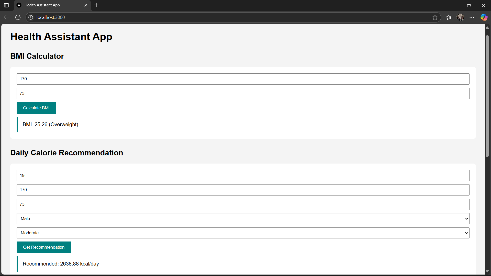

# Health Assistant App with Docker

## Project Overview

The **Health Assistant App** is a simple full-stack web application designed to help users monitor their health. It features:

* BMI (Body Mass Index) Calculator
* Daily Calorie Recommendation
* Diet Suggestion
* Health Check based on age and weight
* Exercise Recommendations

The application is containerized using **Docker** for ease of deployment and reproducibility. It consists of:

* **Frontend**: Static HTML, CSS, and JavaScript
* **Backend**: Python Flask API

---

## Project Structure

```
health-assistant-app/
├── backend/
│   ├── app.py
│   ├── requirements.txt
│   └── Dockerfile
├── frontend/
│   ├── index.html
│   ├── script.js
│   └── Dockerfile
└── docker-compose.yml
```

---

## Step-by-Step Deployment with Docker

### 1. Clone the Repository

```
git clone https://github.com/sulthandhafirr/health-assistant-app.git
cd health-assistant-app
```

### 2. Build and Run Using Docker Compose

```
docker-compose up --build
```

### 3. Open the App

Open your browser and go to:

```
http://localhost:3080
```

You will see the Health Assistant App homepage.

---

## Docker Files

### Backend Dockerfile (`backend/Dockerfile`)

```dockerfile
FROM python:3.11-slim
WORKDIR /app
COPY requirements.txt .
RUN pip install --no-cache-dir -r requirements.txt
COPY . .
EXPOSE 5000
CMD ["python", "app.py"]
```

### Frontend Dockerfile (`frontend/Dockerfile`)

```dockerfile
FROM nginx:alpine
COPY index.html /usr/share/nginx/html/
COPY script.js /usr/share/nginx/html/
```

### Docker Compose File (`docker-compose.yml`)

```yaml
services:
  backend:
    build: ./backend
    ports:
      - "5000:5000"

  frontend:
    build: ./frontend
    ports:
      - "8080:80"
```

---

## Screenshots

### Health Assistant App UI



---

## GitHub Repository

Link: [https://github.com/sulthandhafirr/health-assistant-app](https://github.com/sulthandhafirr/health-assistant-app)

---
